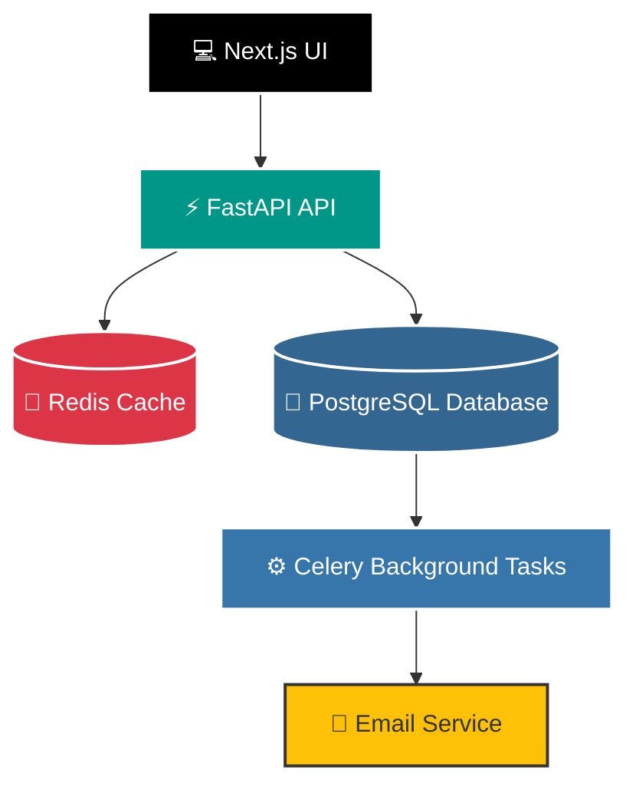

# 🛒 E-Commerce Platform

🚀 Production-ready full-stack E-Commerce application built with FastAPI, Next.js, PostgreSQL, Redis, Docker and AWS.

### 🔗 Live Links

🌐 Store: https://store.manojbhandarkar.cloud

📘 API Docs: https://api.manojbhandarkar.cloud/docs

💻 GitHub Repository: https://github.com/Manoj-Bhandarkar/ecommerce-platform

---

## 🚀 Features

### 👤 Authentication & Authorization

* JWT Authentication           * Refresh Token Support           * Email Verification           * Password Reset via Email
* Protected Routes             * Role-Based Access Control (Admin/User)

---

### 📦 Product Management

* Create Products              * Update Products                  * Delete Products             * Product Search
* Pagination                   * Product Image Upload             * Inventory Management        * Low Stock Monitoring
* Multiple Categories per Product

---

### 📂 Category Management

* Create Categories            * Delete Categories                * Product Count Per Category

---

### 🛒 Shopping Cart

* Add Products to Cart         * Update Quantity                  * Remove Products              * View Cart Summary           * Automatic Total Calculation

---

### 📋 Order Management

* Place Orders                 * View Order History               * Cancel Orders               * Order Status Tracking

---

### 🚚 Shipping Management

* Shipping Address Management           * Shipping Status Updates          * Admin Shipping Control Panel           * Delivery Tracking

---

### 💳 Payment Integration

* Razorpay Integration           * Secure Payment Verification           * Payment History           * Transaction Tracking

---

### 📊 Admin Dashboard

* Revenue Analytics           * Total Products           * Total Orders           * Total Users           * Pending Orders
* Low Stock Alerts            * Recent Orders Tracker

---

### ⚙️ Backend Features

* FastAPI REST API           * SQLAlchemy 2.0 ORM           * PostgreSQL Database           * Alembic Migrations           * Pydantic Validation
* Redis Caching              * Celery Background Tasks      * Email Services                * Dockerized Deployment        * Nginx Reverse Proxy
* Automated Testing with 100% Green Assertions              * Production-Ready GitHub Actions CI/CD Pipeline

---

### 🎨 Frontend Features

* Next.js 15 App Router       * Tailwind CSS                * Axios API Integration         * Context API State Management
* Responsive Design           * Protected Pages             * Admin Dashboard UI
---
# 📸 Application Screenshots

## 🏠 Home Page

---

## 🛒 Admin Dashboard


---

## 📘 API Documentation


---

## ⚙️ CI/CD Pipeline


---

# 🏗️ System Architecture



```

---

# 🗄️ Database Design

## Main Entities

<table>
  <tr>
    <!-- USER TABLE -->
    <td valign="top" width="20%">
      <strong>👤 User</strong>
      <ul>
        <li>id</li>
        <li>email</li>
        <li>password</li>
        <li>is_verified</li>
        <li>role</li>
        <li>created_at</li>
      </ul>
    </td>
    
    <!-- PRODUCT TABLE -->
    <td valign="top" width="20%">
      <strong>📦 Product</strong>
      <ul>
        <li>id</li>
        <li>title</li>
        <li>slug</li>
        <li>description</li>
        <li>sku</li>
        <li>price</li>
        <li>stock_quantity</li>
        <li>image_url</li>
      </ul>
    </td>

    <!-- CATEGORY TABLE -->
    <td valign="top" width="20%">
      <strong>🏷️ Category</strong>
      <ul>
        <li>id</li>
        <li>name</li>
      </ul>
    </td>

    <!-- ORDER TABLE -->
    <td valign="top" width="20%">
      <strong>🛒 Order</strong>
      <ul>
        <li>id</li>
        <li>user_id</li>
        <li>total_price</li>
        <li>status</li>
        <li>created_at</li>
      </ul>
    </td>

    <!-- PAYMENT TABLE -->
    <td valign="top" width="20%">
      <strong>💳 Payment</strong>
      <ul>
        <li>id</li>
        <li>order_id</li>
        <li>amount</li>
        <li>gateway</li>
        <li>is_paid</li>
        <li>status</li>
      </ul>
    </td>
  </tr>
</table>
---

# ER Diagram

```


---

# 🛠️ Tech Stack

## Backend

* FastAPI           * SQLAlchemy 2.0           * PostgreSQL           * Alembic           * Redis           * Celery
* JWT               * Pydantic                 * Razorpay

## Frontend

* Next.js 15        * React                    * Tailwind CSS         * Axios             * Context API

## DevOps & Testing
* Docker & Docker Compose           * Nginx (Reverse Proxy & SSL Integration)           * GitHub Actions (Automated CI/CD Pipeline)
* Pytest & Pytest-Cov (Automated Testing Suite)

---

# 📂 Project Structure

```text
ecommerce-app/
│
├── backend/
│   ├── app/
│   │   ├── api/
│   │   ├── core/
│   │   ├── db/
│   │   ├── dependencies/
│   │   ├── models/
│   │   ├── repositories/
│   │   ├── schemas/
│   │   ├── services/
│   │   ├── tasks/
│   │   ├── tests/
│   │   ├── utils/
│   │   └── admin/
│   ├── alembic/
│   ├── requirements.txt
│   ├── Dockerfile
│   └── docker-compose.yml
│
├── frontend/
│   ├── app/
│   │   ├── cart/
│   │   ├── ccheckout/
│   │   ├── login/
│   │   ├── product/
│   │   ├── register/
│   │   ├── user/
│   │   │   ├── address/
│   │   │   ├── category/
│   │   │   ├── dashboard/
│   │   │   ├── order/
│   │   │   ├── payments/
│   │   │   ├── product/
│   │   │   ├── shippingstatus/
│   ├── components/
│   ├── context/
│   ├── utils/
│   └── package.json
├── screenshots/
└── README.md
```

---

# ⚡ Installation

## Backend

```bash
git clone https://github.com/manoj-bhandarkar/ecommerce-platform.git

cd backend

python -m venv venv

source venv/bin/activate
```

Install dependencies:

```bash
pip install -r requirements.txt
```

Run migrations:

```bash
alembic upgrade head
```

Start server:

```bash
uvicorn app.main:app --reload
```

---

## Frontend

```bash
cd frontend

npm install

npm run dev
```

---

# 🐳 Docker Setup

Run complete application:

```bash
docker compose up --build
```

---

# API Documentation

After starting the backend:

Swagger UI

```text
http://localhost:8000/docs
```

ReDoc

```text
http://localhost:8000/redoc
```

---

# Environment Variables

Backend `.env`

```env
DATABASE_URL=
SECRET_KEY=
REDIS_URL=

SMTP_HOST=
SMTP_PORT=
SMTP_USERNAME=
SMTP_PASSWORD=

RAZORPAY_KEY_ID=
RAZORPAY_KEY_SECRET=
```

Frontend `.env.local`

```env
NEXT_PUBLIC_API_BASE_URL=
NEXT_PUBLIC_RAZORPAY_KEY=
```

---

# Future Improvements

* Product Reviews & Ratings           * Wishlist           * Coupons & Discounts           * Sales Reports

---

# Author

**Manoj Bhandarkar**

Full Stack Developer | Python Developer

---

# License

This project is licensed under the MIT License.
